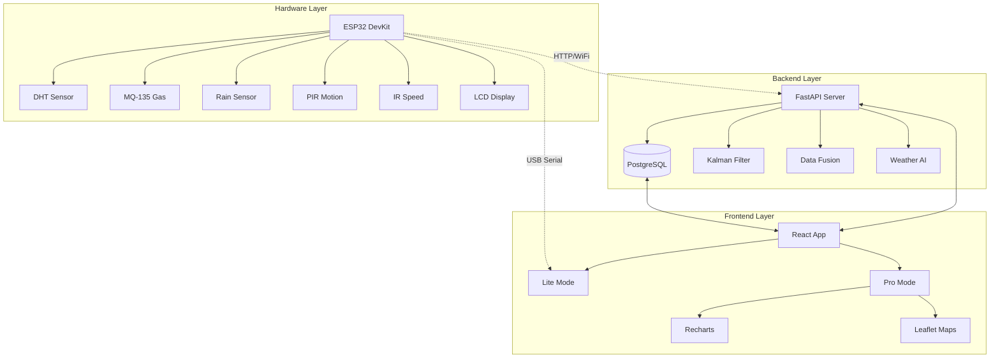

<div align="center">
  
  
  # 🌿 EcoSync Pro: Intelligent Environmental Monitoring System
  
  **Next-Generation IoT Platform for Real-Time Climate Analysis & Predictive Weather Intelligence**
  
  [](https://github.com/projectc943-prog/Ecosync)
  [](LICENSE)
  [](https://python.org)
  [](https://reactjs.org)
  [](https://www.espressif.com/)
</div>

---

## 🚀 Quick Links

- **🌐 Live Demo**: Coming Soon (Deployment in Progress)
- **📖 API Docs**: `http://localhost:8000/docs` (After local setup)
- **📚 Full Documentation**: See [docs/](./docs) directory
- **🔧 Hardware Setup**: See [Hardware Guide](#-hardware-setup)

---

## 📋 Table of Contents

- [Overview](#-overview)
- [Features](#-features)
- [System Architecture](#-system-architecture)
- [Technology Stack](#-technology-stack)
- [Getting Started](#-getting-started)
- [Hardware Setup](#-hardware-setup)
- [Project Structure](#-project-structure)
- [API Documentation](#-api-documentation)
- [Contributing](#-contributing)
- [License](#-license)

---

## 🌟 Overview

**EcoSync Pro** is a comprehensive environmental monitoring system that combines IoT hardware (ESP32), real-time data processing, and intelligent analytics to provide actionable climate insights. The system features dual operational modes:

- **📱 Lite Mode**: Direct USB connection for real-time sensor monitoring
- **☁️ Pro Mode**: Cloud-connected dashboard with historical data, predictive analytics, and global mapping

Perfect for **academic research**, **smart cities**, **agriculture**, and **climate monitoring applications**.

---

## ✨ Features

### 🎯 Core Capabilities

#### Pro Mode (Cloud-Connected)
- ✅ **Real-Time Monitoring**: Live sensor data dashboard with Kalman-filtered readings
- ✅ **Historical Analytics**: 24-hour trend visualization with interactive charts
- ✅ **Predictive Weather**: AI-powered weather forecasting based on sensor patterns
- ✅ **Global Mapping**: Leaflet-based interactive map with sensor node locations
- ✅ **Multi-User Support**: Secure authentication with role-based access control
- ✅ **Smart Alerts**: Configurable thresholds with email notifications
- ✅ **Data Export**: CSV/JSON export for further analysis

#### Lite Mode (Edge Computing)
- ✅ **USB Serial Connection**: Direct ESP32 connection via Web Serial API
- ✅ **Zero Latency**: <100ms response time for debugging
- ✅ **Offline Operation**: Full functionality without internet
- ✅ **Privacy-First**: No data leaves your local machine
- ✅ **Signal Processing**: Real-time EMA filtering visualization

### 🔬 Sensor Capabilities
- 🌡️ **Temperature & Humidity** (DHT11/DHT22)
- 💨 **Air Quality** (MQ-135 Gas Sensor)
- 💧 **Rain Detection** (Capacitive Rain Sensor)
- 👤 **Motion Detection** (PIR Sensor)
- 🚗 **Speed Detection** (IR Sensor)
- 📊 **Kalman Filtering** for noise reduction
- 🔄 **Auto-Calibration** on startup

---

## 🏗️ System Architecture



### Data Flow
1. **ESP32** reads sensors every 2 seconds
2. **Kalman Filter** processes raw data for noise reduction
3. Data sent via **HTTP POST** to backend API
4. **Backend** stores data in PostgreSQL with timestamp
5. **Frontend** fetches data via REST API or WebSocket
6. **Dashboard** visualizes data with interactive charts

---

## 🛠️ Technology Stack

### Frontend
| Technology | Version | Purpose |
|-----------|---------|---------|
| **React** | 18+ | UI Framework |
| **Vite** | 5+ | Build Tool & Dev Server |
| **TailwindCSS** | 3+ | Styling Framework |
| **Recharts** | 2+ | Data Visualization |
| **Leaflet** | 1.9+ | Interactive Maps |
| **Lucide React** | Latest | Icon Library |

### Backend
| Technology | Version | Purpose |
|-----------|---------|---------|
| **Python** | 3.9+ | Programming Language |
| **FastAPI** | 0.104+ | Web Framework |
| **SQLAlchemy** | 2.0+ | ORM |
| **PostgreSQL** | 14+ | Database |
| **Uvicorn** | 0.24+ | ASGI Server |
| **Pydantic** | 2.0+ | Data Validation |

### Hardware
| Component | Model | Purpose |
|-----------|-------|---------|
| **MCU** | ESP32 DevKit | Main Controller |
| **Temp/Humidity** | DHT11/DHT22 | Climate Sensing |
| **Air Quality** | MQ-135 | Gas Detection |
| **Rain Sensor** | Capacitive | Water Detection |
| **Motion** | PIR HC-SR501 | Movement Detection |
| **Speed** | IR Sensor | Object Speed |
| **Display** | LCD 16x2 I2C | Local Readout |

---

## 🚀 Getting Started

### Prerequisites

- **Node.js** 18+ and npm
- **Python** 3.9+ and pip
- **PostgreSQL** 14+ (or use SQLite for development)
- **ESP32** with PlatformIO (for hardware)

### 🔧 Installation

#### 1. Clone the Repository
```bash
git clone https://github.com/projectc943-prog/Ecosync.git
cd Ecosync
```

#### 2. Backend Setup
```bash
cd backend

# Create virtual environment
python3 -m venv venv
source venv/bin/activate  # On Windows: venv\Scripts\activate

# Install dependencies
pip install -r requirements.txt

# Configure environment
cp .env.example .env
# Edit .env with your database credentials

# Run migrations (creates tables)
python3 start.py  # Auto-creates tables on first run

# Start backend server
python3 start.py
# API will be available at http://localhost:8000
```

#### 3. Frontend Setup
```bash
cd frontend

# Install dependencies
npm install

# Configure environment
cp .env.example .env
# Edit .env with your backend URL

# Start development server
npm run dev
# Frontend will be available at http://localhost:5173
```

#### 4. Hardware Setup (Optional)
```bash
cd hardware

# Flash ESP32 with PlatformIO
pio run --target upload

# Or use the helper script
chmod +x ../upload.sh
../upload.sh
```

---

## 🔌 Hardware Setup

### Wiring Diagram

```
ESP32 Pin Layout:
├── GPIO 4  → DHT11/DHT22 Data Pin
├── GPIO 34 → MQ-135 Analog Out
├── GPIO 35 → Rain Sensor Analog Out
├── GPIO 14 → PIR Motion Digital Out
├── GPIO 27 → IR Speed Sensor Digital Out
├── GPIO 21 → LCD SDA (I2C)
└── GPIO 22 → LCD SCL (I2C)
```

### Configuration

Edit `hardware/config.h` with your WiFi credentials:

```cpp
#define WIFI_SSID "YourWiFiName"
#define WIFI_PASS "YourPassword"
#define SERVER_URL "http://your-backend-url:8000/api/iot/data"
```

### Quick Upload

```bash
cd /path/to/Ecosync-Pro
./upload.sh
```

This script automatically:
- Activates PlatformIO environment
- Compiles firmware
- Uploads to ESP32
- Monitors serial output

### LCD Display

The LCD cycles through 3 screens every 2 seconds:
1. **Screen 1**: Temperature & Humidity
2. **Screen 2**: Gas & Rain Status
3. **Screen 3**: Motion & Speed Detection

---

## 📁 Project Structure

```
Ecosync-Pro/
├── backend/                   # FastAPI Backend
│   ├── app/
│   │   ├── main.py           # Main FastAPI application
│   │   ├── models.py         # SQLAlchemy models
│   │   ├── schemas.py        # Pydantic schemas
│   │   ├── database.py       # Database configuration
│   │   ├── routers/          # API routes
│   │   │   ├── auth_v2.py    # Authentication endpoints
│   │   │   ├── devices.py    # Device management
│   │   │   └── pro_api.py    # Pro mode endpoints
│   │   └── services/         # Business logic
│   │       ├── kalman_filter.py
│   │       ├── fusion_engine.py
│   │       └── weather_service.py
│   ├── requirements.txt      # Python dependencies
│   └── start.py             # Server entry point
│
├── frontend/                 # React Frontend
│   ├── src/
│   │   ├── pages/           # Page components
│   │   │   ├── Dashboard.jsx
│   │   │   ├── LightDashboard.jsx
│   │   │   ├── ProDashboard.jsx
│   │   │   └── Analytics.jsx
│   │   ├── components/      # Reusable components
│   │   ├── contexts/        # React contexts (Auth, ESP32)
│   │   ├── hooks/           # Custom hooks
│   │   └── config.js        # Configuration
│   ├── package.json
│   └── vite.config.js
│
├── hardware/                 # ESP32 Firmware
│   ├── src/
│   │   └── main.cpp         # Main Arduino sketch
│   ├── config.h             # WiFi & Server config
│   ├── platformio.ini       # PlatformIO configuration
│   └── arduino_code/        # Additional examples
│
├── docs/                     # Documentation
│   ├── DEPLOYMENT_GUIDE.md
│   ├── DISCLAIMER.md
│   └── README_LOCAL_SETUP.md
│
├── scripts/                  # Helper scripts
│   ├── start_local.sh       # Start both frontend & backend
│   └── restart_backend.bat
│
├── upload.sh                # ESP32 upload helper
├── README.md                # This file
└── LICENSE                  # MIT License
```

---

## 📡 API Documentation

### Base URL
```
http://localhost:8000/api
```

### Authentication

#### Register User
```http
POST /api/register
Content-Type: application/json

{
  "email": "user@example.com",
  "password": "secure_password",
  "first_name": "John",
  "last_name": "Doe",
  "plan": "lite"  // or "pro"
}
```

#### Login
```http
POST /api/token
Content-Type: application/x-www-form-urlencoded

username=user@example.com&password=secure_password
```

### Sensor Data

#### Submit IoT Data (ESP32)
```http
POST /api/iot/data
Content-Type: application/json

{
  "temperature": 25.5,
  "humidity": 60.0,
  "mq_value": 450,
  "rain_value": 1200,
  "motion_detected": false,
  "ir_detected": false,
  "pm25": 35.0,
  "pressure": 1013.25
}
```

#### Get Historical Data
```http
GET /api/data?limit=100
Authorization: Bearer <token>
```

#### Get Pro Dashboard Data
```http
GET /api/pro-data?lat=17.3850&lon=78.4867
Authorization: Bearer <token>
```

### Interactive API Docs
Visit `http://localhost:8000/docs` for full Swagger/OpenAPI documentation.

---

## 🧪 Testing

### Backend Tests
```bash
cd backend
pytest tests/ -v
```

### Frontend Tests
```bash
cd frontend
npm run test
```

### Hardware Serial Monitor
```bash
cd hardware
pio device monitor -b 115200
```

---

## 🤝 Contributing

We welcome contributions! Please follow these steps:

1. **Fork** the repository
2. **Create** a feature branch (`git checkout -b feature/amazing-feature`)
3. **Commit** your changes (`git commit -m 'Add amazing feature'`)
4. **Push** to the branch (`git push origin feature/amazing-feature`)
5. **Open** a Pull Request

### Code Style
- **Python**: Follow PEP 8, use `black` for formatting
- **JavaScript**: Use ESLint + Prettier configuration
- **C++**: Follow Arduino style guide

---

## 📝 License

This project is licensed under the **MIT License** - see the [LICENSE](LICENSE) file for details.

---

## 🙏 Acknowledgments

- **ESP32 Community** for excellent hardware documentation
- **FastAPI** team for the amazing web framework
- **React** ecosystem for powerful frontend tools
- **Leaflet** for beautiful mapping capabilities

---

## 📧 Contact

**Project Team**: Capstone S4  
**Repository**: [github.com/projectc943-prog/Ecosync](https://github.com/projectc943-prog/Ecosync)  
**Issues**: [Report a bug](https://github.com/projectc943-prog/Ecosync/issues)

---

<div align="center">
  <sub>Built with ❤️ for a sustainable future • 2026</sub>
  
  **[⬆ Back to Top](#-ecosync-pro-intelligent-environmental-monitoring-system)**
</div>
