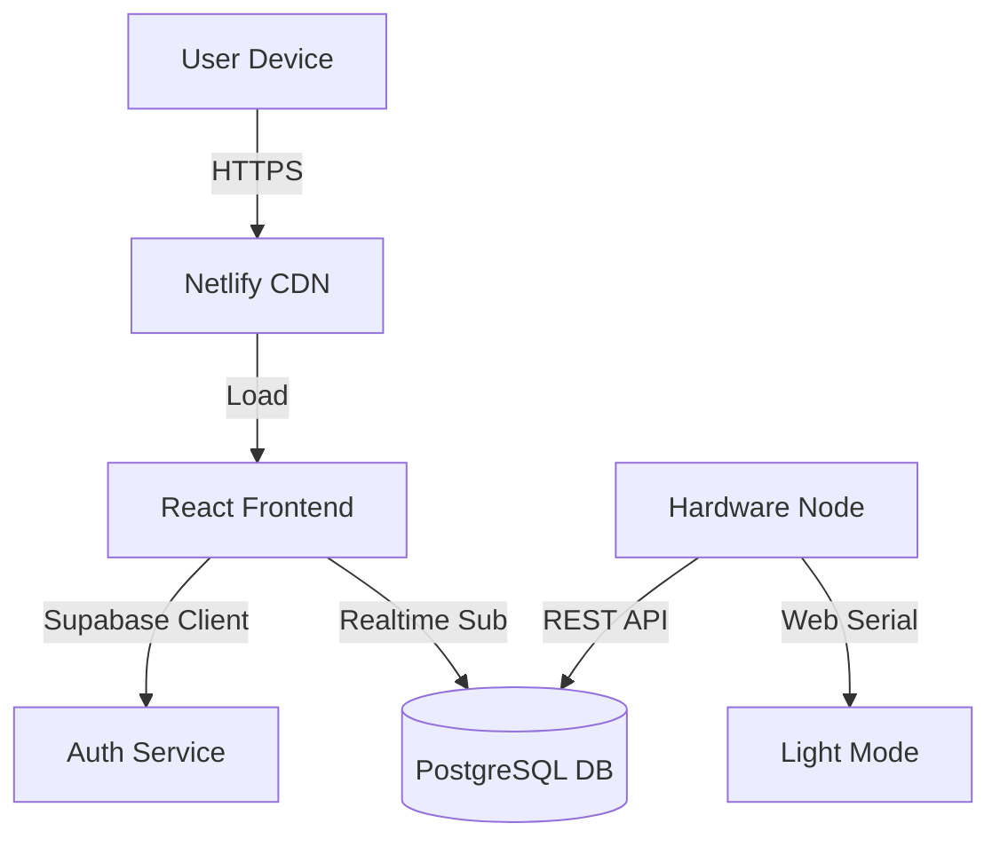

  
  
  # EcoSync S4: Intelligent Environmental Monitoring
  
  **Next-Gen IoT Dashboard for Real-Time & Predictive Climate Analysis**
  
  
  
  

---

## 🚀 Live Access
> **Academic Project Disclaimer**: This application is a prototype developed for the "Symbiotic Eco-Intelligence Network" capstone project. Data shown may be simulated if hardware nodes are offline.

- **Frontend (Dashboard)**: [https://ecosync-s4-demo.vercel.app](https://ecosync-s4-demo.vercel.app)
- **Backend (API)**: [https://ecosync-s4-demo.vercel.app/api/docs](https://ecosync-s4-demo.vercel.app/api/docs)
- **Database (Supabase)**: Connected via Secure RPC

### 🔐 Access
- Please use the "Register" button to create a new bio-profile.

---

## 🏗️ System Architecture

EcoSync S4 moves beyond simple data logging by utilizing a separated **Client-Server-Hardware** architecture.

### Why This Architecture?
1.  **Scalability**: By using **Supabase (PostgreSQL)**, we can handle millions of sensor readings without managing a backend server manually.
2.  **Global Access**: The Frontend is deployed on **Netlify Edge**, ensuring sub-second load times worldwide.
3.  **Reliability**: The **Dual-Mode** system ensures functionality even during internet outages via the Serial fallback.

---

## 🛠️ Technology Stack

| Layer | Technology | Purpose |
| :--- | :--- | :--- |
| **Frontend** | **React + Vite** | High-performance SPA with fast hot-reload |
| **Styling** | **TailwindCSS** | Custom "Bio-Tech" theme with glassmorphism |
| **Backend** | **Supabase** | Auth, Database, and Realtime subscriptions |
| **Hardware** | **ESP32** | Dual-Core MCU for handling sensors |
| **Deployment** | **Vercel** | CI/CD pipeline and Edge hosting |

---

## 🌟 Key Features

### 🟢 Pro Mode (Cloud)
-   **Historical Data**: View 24h temperature trends stored in Postgres.
-   **Global Map**: Visualize sensor nodes on a Leaflet map.
-   **Secure**: Row Level Security (RLS) protects data.

### 🟡 Light Mode (Edge)
-   **Zero-Internet**: Connect directly via USB Cable.
-   **Real-Time**: 100ms latency for instant debugging.
-   **Privacy-First**: No data leaves your local machine.

---

## 📂 Documentation (Updated)

Everything you need to replicate this project:

-   **[Deployment Guide](docs/deployment_guide.md)**: How to set up Netlify and Supabase.
-   **[Features Overview](docs/features.md)**: Deep dive into the Bio-Auth and Dashboard modes.
-   **[Codebase Map](docs/code_map.md)**: Structure of `frontend/` and `hardware/`.
-   **[Implementation Details](docs/implementation_details.md)**: Technical specs.

---

  Developed by Capstone Team S4 • 2026

